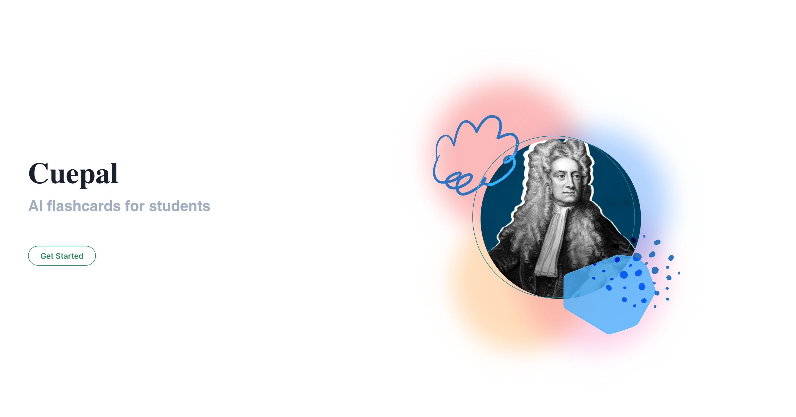

# Cuepal

## Inspiration

Recognizing the effectiveness of flashcards in learning new material, we observed a common reluctance among students to create them. This sparked the idea for Cuepal: an interactive, classroom-integrated tool. With Cuepal, students actively engage in note-taking during lessons. These notes are then transformed by OpenAI's GPT-4 into tailored flashcards and quiz questions, ensuring students remain attentive and immediately benefit from customized study materials. This approach not only reinforces learning in real-time but also streamlines the creation of educational resources.

## What it does

At its core, Cuepal offers a novel approach to learning:

1. Teachers input learning objectives and resources.
1. Students document their insights throughout the lesson.
1. The system identifies gaps in their notes and formulates targeted questions.
1. Students respond to these questions to reinforce their understanding.
1. Ultimately, personalized flashcards are generated, reflecting each student's unique learning journey.

## How we built it

Our toolkit for Cuepal included Next.js, Chakra UI, Azure DB PostgreSQL, and OpenAI's GPT-4 for question generation. This combination enabled us to create a responsive, user-friendly interface and leverage advanced AI capabilities for educational content creation.

## Challenges we ran into

Our primary hurdle was the inaccessibility of Azure's OpenAI services under our student subscription, prompting us to use alternative means to integrate the OpenAI API. Further, refining GPT-4's outputs and developing a comprehensive platform that caters to both teachers and students proved challenging. Currently, the platform is student-oriented, with future plans for teacher integration.

## Accomplishments that we're proud of

We successfully developed a working prototype that generates flashcards and quiz questions based on in-class notes. Furthermore, our platform includes sections for students to engage in quizzes and review flashcards, all personalized to their individual learning paths.

## What we learned

Our journey with Cuepal revealed the impressive capabilities of GPT-4 in crafting effective educational tools like quizzes and flashcards. We've also learned the immense value personalized education holds in enhancing a student's learning experience.

## What's next for Cuepal

Looking ahead, we aim to introduce a teacher's module for class and student management. Additionally, we envision integrating a digital tutor for each student, offering personalized guidance and insights into their knowledge gaps and errors. This next step will further our mission to revolutionize the educational experience through tailored, AI-enhanced learning tools.
